<a id="readme-top"></a>

<!-- BADGES -->
[](https://github.com/iprashanthvanam/the_pet_portal/stargazers)
[](https://github.com/iprashanthvanam/the_pet_portal/network/members)
[](https://github.com/iprashanthvanam/the_pet_portal/issues)
[](LICENSE)
[](https://python.org)
[](https://djangoproject.com)
[](https://razorpay.com)
[](https://ai.google.dev)
[](https://prashanthvanam.pythonanywhere.com)

---

<div align="center">

# The Pet Portal 🐾
### A Full-Stack Pet Marketplace & Service Management System

*Adopt pets, shop for supplies, book vet appointments, grooming and boarding services — all in one production-grade Django platform with Razorpay payments and a Gemini AI chatbot.*

<br/>

[](https://prashanthvanam.pythonanywhere.com)
[](https://github.com/iprashanthvanam/the_pet_portal/issues/new?labels=bug)
[](https://github.com/iprashanthvanam/the_pet_portal/issues/new?labels=enhancement)

<br/>

<!-- HERO SCREENSHOT -->
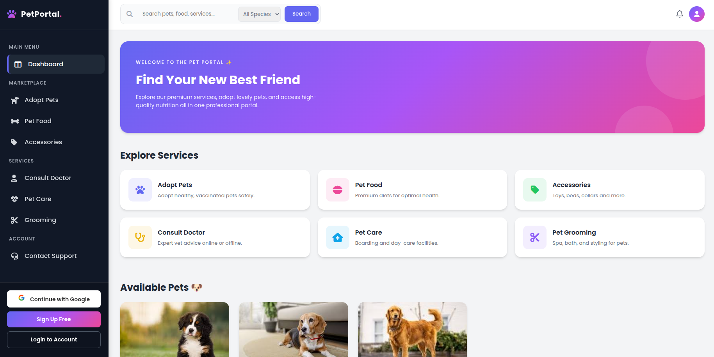

> **The Pet Portal** — A complete pet marketplace covering adoption, shopping, services, payments, and AI assistance

</div>

---

<!-- TABLE OF CONTENTS -->
<!--
  HOW GITHUB ANCHOR LINKS WORK:
  GitHub auto-generates anchors from heading text:
  - All letters → lowercase
  - Spaces → hyphens
  - Special chars (brackets, slashes, apostrophes, emoji) → removed
  - Example: "## Payment Integration (Razorpay)" → #payment-integration-razorpay
  - Example: "## AI Chatbot (Gemini)"             → #ai-chatbot-gemini
  - Example: "## Deployment (PythonAnywhere)"      → #deployment-pythonanywhere
-->
<details>
  <summary>📑 Table of Contents</summary>
  <ol>
    <li><a href="#about-the-project">About The Project</a></li>
    <li><a href="#screenshots">Screenshots</a></li>
    <li><a href="#key-features">Key Features</a></li>
    <li><a href="#tech-stack">Tech Stack</a></li>
    <li><a href="#system-architecture">System Architecture</a></li>
    <li><a href="#application-workflow">Application Workflow</a></li>
    <li><a href="#database-models">Database Models</a></li>
    <li><a href="#payment-integration-razorpay">Payment Integration (Razorpay)</a></li>
    <li><a href="#ai-chatbot-gemini">AI Chatbot (Gemini)</a></li>
    <li><a href="#getting-started">Getting Started</a></li>
    <li><a href="#environment-variables">Environment Variables</a></li>
    <li><a href="#project-structure">Project Structure</a></li>
    <li><a href="#security">Security</a></li>
    <li><a href="#deployment-pythonanywhere">Deployment (PythonAnywhere)</a></li>
    <li><a href="#roadmap">Roadmap</a></li>
    <li><a href="#contributing">Contributing</a></li>
    <li><a href="#license">License</a></li>
    <li><a href="#contact">Contact</a></li>
    <li><a href="#acknowledgments">Acknowledgments</a></li>
  </ol>
</details>

---

## About The Project

Most pet owners juggle multiple platforms — one for adoption, another for food delivery, a third for vet bookings, and another for grooming. There's no single, integrated place to manage everything about a pet.

**The Pet Portal** is a production-grade, full-stack Django web application that solves this. It brings together pet adoption listings, a food and accessories marketplace, doctor consultation booking, grooming appointments, boarding services, real-time Razorpay payments, PDF invoicing, order tracking, and a Gemini AI-powered chatbot — all in one place.

**Why The Pet Portal?**

- ❌ **Old approach:** Fragmented services across multiple apps and websites
- ✅ **Our approach:** A single Django platform covering the entire pet ownership journey — from adoption to aftercare
- 🎯 **Outcome:** A real-world, production-deployed application with industry-grade payment flows, order lifecycle management, and AI-assisted pet advice

> This project was developed as part of the **Edunet Foundation – NextGen Employability Program (Capstone Project)**.

<p align="right">(<a href="#readme-top">back to top</a>)</p>

---

## Screenshots

A complete visual walkthrough of every screen in The Pet Portal.

---

### 🏠 Home Page

<div align="center">
  
  <br/><br/>
  <sub><b>Landing page.</b> Hero banner, featured pets, food categories, and service highlights — built with responsive HTML/CSS and Google Fonts (Poppins).</sub>
</div>

---

### 📝 Register

<div align="center">
  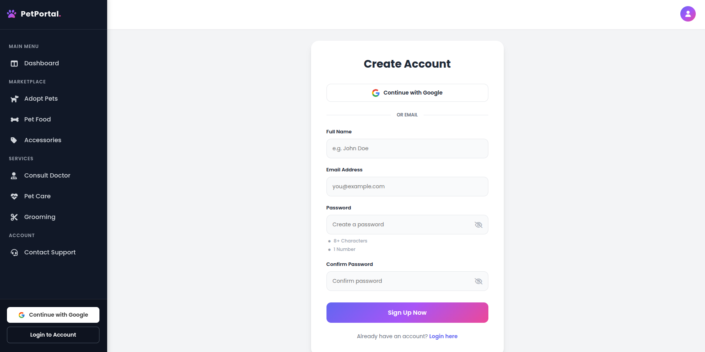
  <br/><br/>
  <sub><b>User registration.</b> New users create an account with username, email, and password. Profile is auto-created via Django signals on registration.</sub>
</div>

---

### 🔐 Login

<div align="center">
  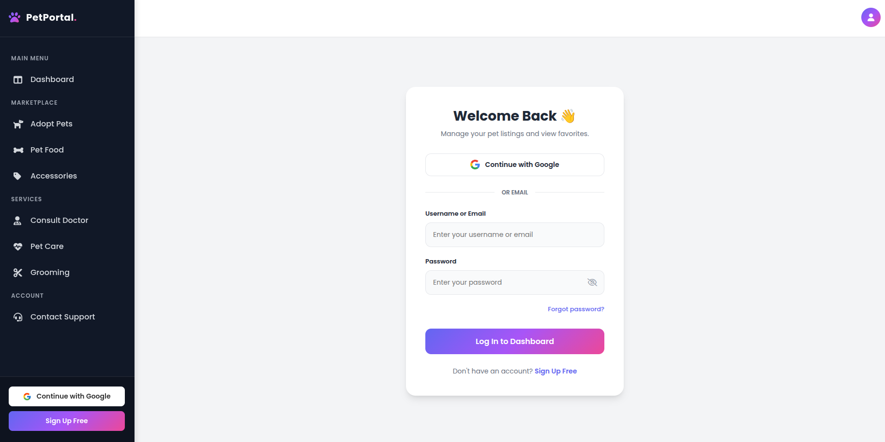
  <br/><br/>
  <sub><b>User authentication.</b> Django's built-in auth system extended with <code>django-allauth</code> for social login. Cart data persists across login via session merge.</sub>
</div>

---

### 🐾 Pet Listing

<div align="center">
  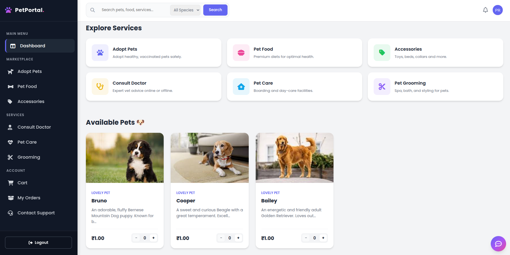
  <br/><br/>
  <sub><b>Pet marketplace.</b> Browse all available pets with live search, species filter, and price range filter.</sub>
</div>

---

### 🔎 Pet Detail

<div align="center">
  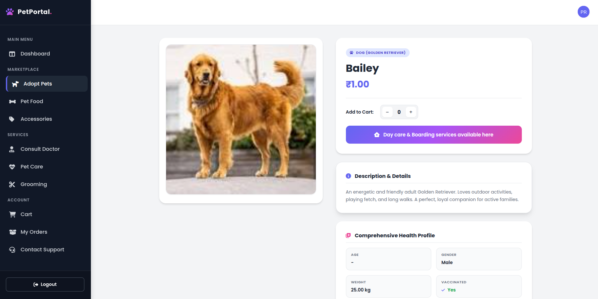
  <br/><br/>
  <sub><b>Pet detail page.</b> Full health profile per pet — vaccination status, weight, microchip ID, vet contact, diet type, temperament, and adoption readiness.</sub>
</div>

---

### 🛒 Cart

<div align="center">
  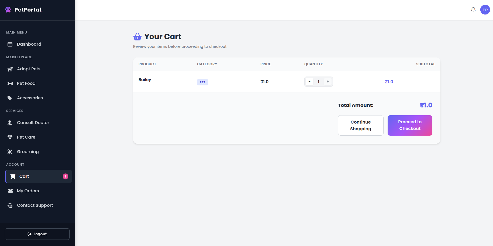
  <br/><br/>
  <sub><b>Shopping cart.</b> Session-based cart supports pets, food, and accessories together. Quantity updates via Ajax — no page reload required.</sub>
</div>

---

### 💳 Checkout

<div align="center">
  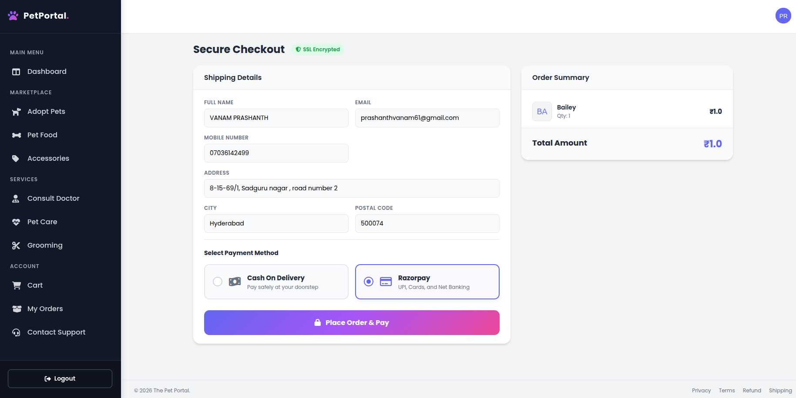
  <br/><br/>
  <sub><b>Checkout page.</b> Enter delivery details and choose payment method — Cash on Delivery or Razorpay online payment with real-time server-side verification.</sub>
</div>

---

### ✅ Order Success

<div align="center">
  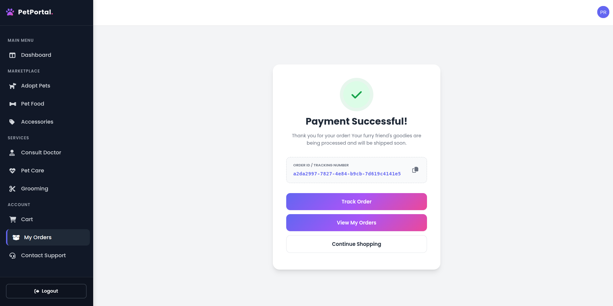
  <br/><br/>
  <sub><b>Order confirmation.</b> Displayed after a successful order placement or Razorpay payment. Shows Order ID, summary, and links to track or view history.</sub>
</div>

---

### 📦 Order History

<div align="center">
  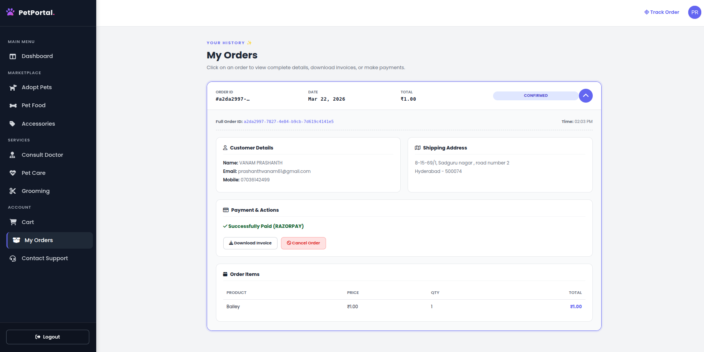
  <br/><br/>
  <sub><b>Order history.</b> Full list of all past orders with status badges (CONFIRMED → PROCESSING → SHIPPED → DELIVERED), payment status, and invoice download link.</sub>
</div>

---

### 🔍 Order Tracking

<div align="center">
  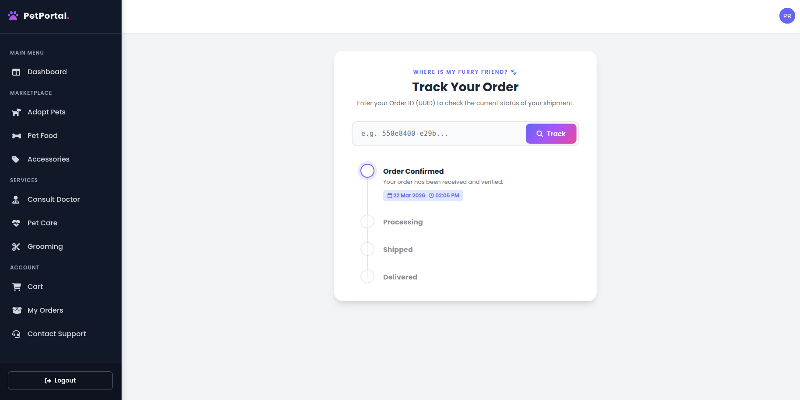
  <br/><br/>
  <sub><b>Public order tracking.</b> Track any order using its UUID-based Order ID — no login required. Displays customer name, total, current status, and the full status timeline.</sub>
</div>

---

### 🧾 Invoice

<div align="center">
  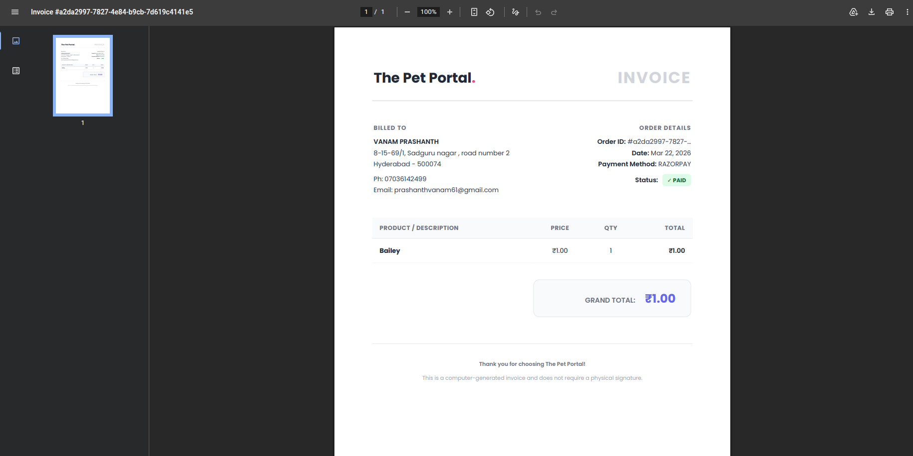
  <br/><br/>
  <sub><b>PDF invoice.</b> WeasyPrint generates a formatted invoice per order — customer details, itemised list, payment method, payment status, and total. Downloadable by user and admin.</sub>
</div>

---

### 🩺 Consult a Doctor

<div align="center">
  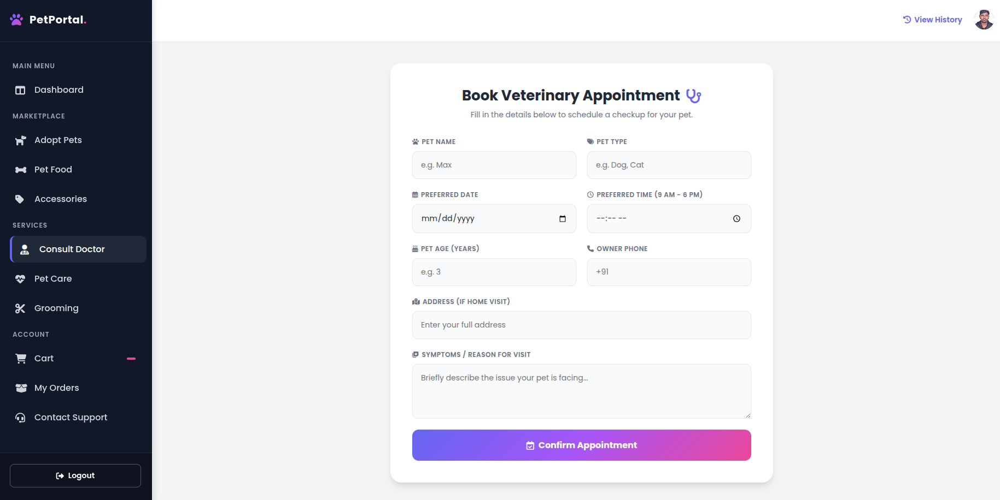
  <br/><br/>
  <sub><b>Vet consultation booking.</b> Book a vet appointment by entering pet name, species, age, symptoms, preferred date/time, and contact details.</sub>
</div>

---

### 📋 Appointment History

<div align="center">
  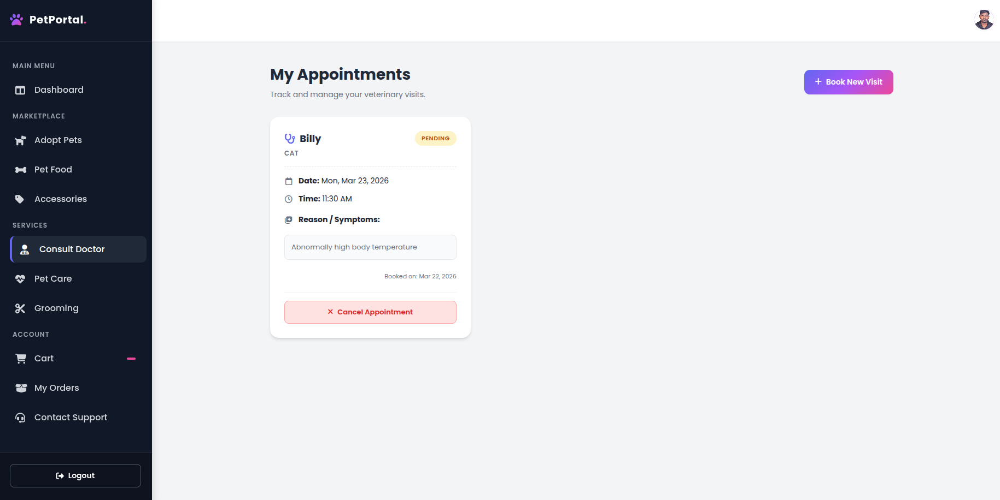
  <br/><br/>
  <sub><b>Appointment history.</b> View all upcoming and past vet appointments with status (PENDING / APPROVED / COMPLETED / CANCELLED) and cancellation option.</sub>
</div>

---

### ✂️ Grooming Booking

<div align="center">
  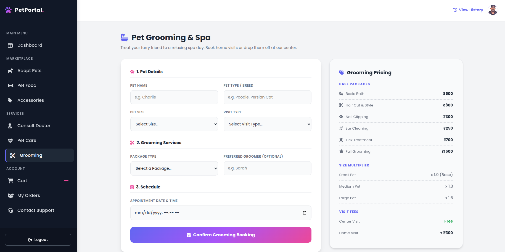
  <br/><br/>
  <sub><b>Pet grooming booking.</b> Choose from 6 packages — Basic Bath, Haircut & Styling, Nail Clipping, Ear Cleaning, Tick Treatment, or Full Package. Price auto-calculated by pet size and visit type (Center / Home +₹300).</sub>
</div>

---

### 📋 Grooming History

<div align="center">
  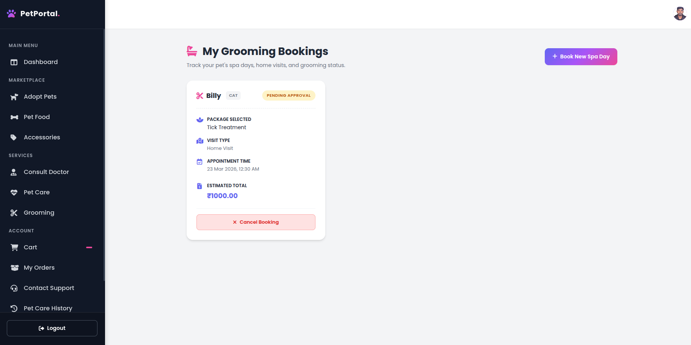
  <br/><br/>
  <sub><b>Grooming booking history.</b> View all grooming appointments with package type, pet size, visit type, total price, and current status.</sub>
</div>

---

### 🏡 Pet Care Booking

<div align="center">
  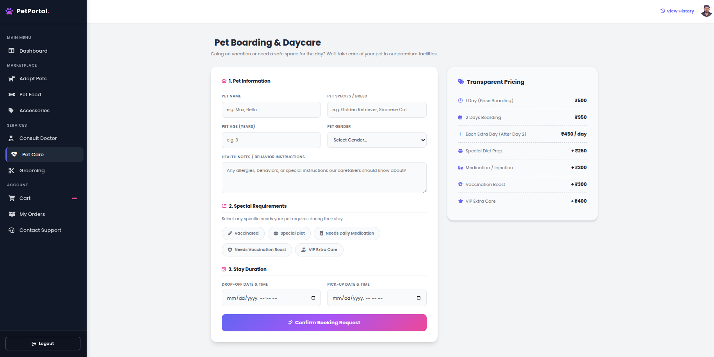
  <br/><br/>
  <sub><b>Pet boarding / day care booking.</b> Book overnight or multi-day care with optional add-ons — special diet (+₹250), injections (+₹200), vaccinations (+₹300), extra care (+₹400). Price calculated automatically on save.</sub>
</div>

---

### 📋 Pet Care History

<div align="center">
  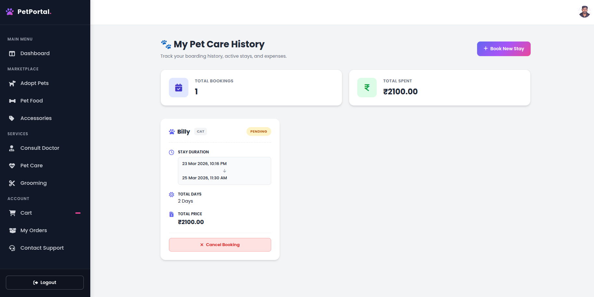
  <br/><br/>
  <sub><b>Pet care booking history.</b> View all boarding bookings with start/end dates, total days, add-ons, total price, and status.</sub>
</div>

---

### 🤖 AI Chatbot

<div align="center">
  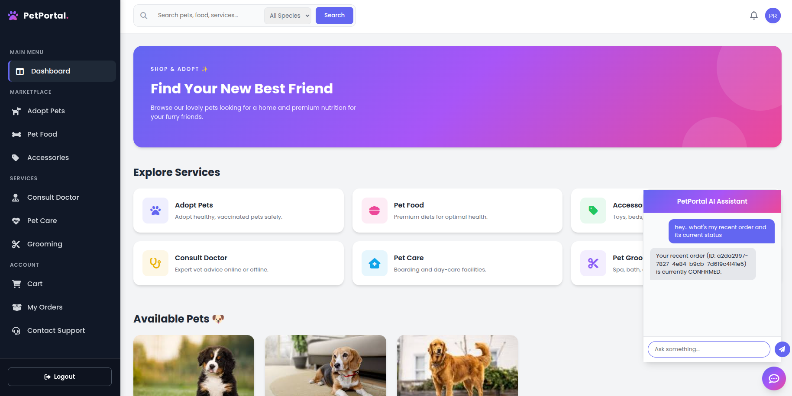
  <br/><br/>
  <sub><b>Gemini-powered pet assistant.</b> Embedded AI chatbot built with Google's <code>google-genai</code> SDK. Answers pet care questions, product queries, and service information in real time.</sub>
</div>

---

### 🛠️ Admin AI Dashboard

<div align="center">
  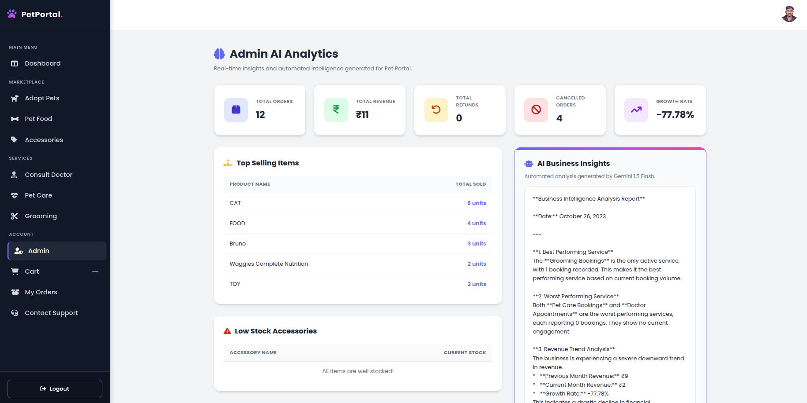
  <br/><br/>
  <sub><b>Admin AI analytics dashboard.</b> A Gemini-powered internal dashboard for admins to query platform data, order trends, and get AI-assisted insights.</sub>
</div>

---

### 🎛️ Django Admin Panel

<div align="center">
  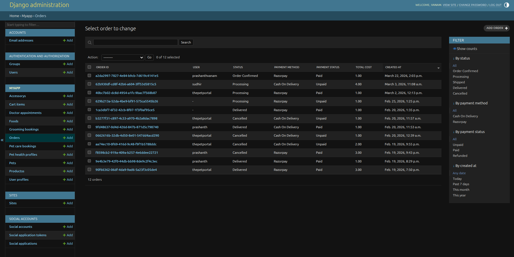
  <br/><br/>
  <sub><b>Full admin control.</b> Manage pets, food, orders (with inline items), appointments, grooming bookings, pet care bookings, accessories, and users — styled with <code>django-jazzmin</code> and <code>django-unfold</code>.</sub>
</div>

---

<p align="right">(<a href="#readme-top">back to top</a>)</p>
---

## Key Features

### 🐾 Marketplace
- **Pet Adoption Listings** — Browse with live search, species filter, and price range
- **Pet Health Profiles** — Vaccination, dewormed, neutered, microchip ID, vet contact, diet, temperament, and adoption readiness — linked one-to-one per pet
- **Pet Food Shop** — Browse by food type, view MFG and expiry dates
- **Pet Accessories** — Toys, beds, leashes, collars, clothing, supplements — filterable by category, pet type, size, and colour with stock tracking
- **Detailed Product Pages** — Full detail view for pets, food, and accessories

### 🛒 E-commerce Engine
- **Session-based cart** — Persists across login/logout; guest cart merges on login via Django signals
- **Multi-type cart** — Supports pets, food, and accessories together in one cart
- **Ajax cart updates** — Quantity changes without page reload
- **Cash on Delivery (COD)** — Instant order placement, payment collected on delivery
- **Razorpay Online Payment** — In-browser checkout modal with server-side HMAC-SHA256 signature verification
- **Razorpay Webhooks** — `payment.captured` event syncs payment state even if user closes browser
- **Retry Payment** — Users can re-attempt failed Razorpay payments from order history
- **Order Cancellation + Auto-Refund** — Triggers Razorpay refund, stores RRN, marks order CANCELLED + REFUNDED
- **PDF Invoices** — Generated with WeasyPrint, downloadable by user and admin

### 📦 Order Management
- **UUID-based Order IDs** — Collision-proof unique identifiers per order
- **Full lifecycle tracking** — CONFIRMED → PROCESSING → SHIPPED → DELIVERED with timestamps per stage
- **Public order tracking** — Track any order by Order ID without logging in
- **Order history** — Complete history with payment status and invoice download

### 🩺 Services
- **Vet Consultation Booking** — Book appointments with pet details, symptoms, preferred date/time
- **Pet Grooming Booking** — 6 packages with auto-pricing by pet size and center/home visit type
- **Pet Boarding / Day Care** — Multi-day booking with 4 optional add-ons and auto price calculation
- **Service History & Cancellation** — View and cancel all bookings from dedicated history pages

### 🤖 AI Features
- **Gemini AI Chatbot** — Real-time pet care assistant via `POST /api/chatbot/`
- **Admin AI Dashboard** — Gemini-powered analytics for admins at `/admin-ai-dashboard/`

### 👤 User Management
- **Django Authentication** — Registration, login, logout, session management
- **Social Login** — `django-allauth` integration
- **User Profile** — Profile image, phone, address, city — auto-created via Django signals
- **Role-based access** — User vs Admin enforced at view level

<p align="right">(<a href="#readme-top">back to top</a>)</p>

---

## Tech Stack

| Layer | Technology |
|-------|-----------|
| **Backend** | Django 5.2 (Python 3.11+) |
| **Database** | SQLite (dev / PythonAnywhere demo) |
| **Frontend** | HTML5, CSS3, JavaScript (Poppins, Font Awesome 6) |
| **Payments** | Razorpay (order create, verify, webhooks, refunds) |
| **AI** | Google Gemini (`google-genai` SDK) |
| **PDF Generation** | WeasyPrint + ReportLab |
| **Authentication** | Django Auth + django-allauth (social login) |
| **Admin UI** | django-jazzmin + django-unfold |
| **REST API** | Django REST Framework |
| **Sessions** | Django Sessions (cart + login persistence) |
| **Deployment** | PythonAnywhere |
| **Media** | Pillow (image processing) |

<p align="right">(<a href="#readme-top">back to top</a>)</p>

---

## System Architecture

```
┌───────────────────────────────────────────────────────────────────┐
│                    FRONTEND (HTML / CSS / JS)                     │
│                                                                   │
│  Home │ Pets │ Food │ Accessories │ Cart │ Checkout │ Profile     │
│  Consult │ Grooming │ Pet Care │ Track Order │ AI Chatbot         │
└────────────────────────┬──────────────────────────────────────────┘
                         │  HTTP (Django Sessions + CSRF)
┌────────────────────────▼─────────────────────────────────────────┐
│                  DJANGO BACKEND (views.py — 40+ views)           │
│                                                                  │
│  Auth Layer          │  Cart Engine         │  Order Engine      │
│  (Django Auth +      │  (Session + DB,      │  (UUID Orders,     │
│   allauth)           │   merge on login)    │  lifecycle, times) │
│                                                                  │
│  ┌──────────────────────────────────────────────────────────┐    │
│  │                 PAYMENT ENGINE (Razorpay)                │    │
│  │  Create Order → JS Modal → Verify Signature              │    │
│  │  Mark Paid → Webhook Sync → Refund Flow                  │    │
│  └──────────────────────────────────────────────────────────┘    │
│                                                                  │
│  ┌──────────────────────────────────────────────────────────┐    │
│  │              SERVICE BOOKING ENGINE                      │    │
│  │  Vet Appointments │ Grooming │ Pet Care / Boarding       │    │
│  │  Auto-pricing │ Status Lifecycle │ Cancellation          │    │
│  └──────────────────────────────────────────────────────────┘    │
│                                                                  │
│  ┌──────────────────────────────────────────────────────────┐    │
│  │                      AI LAYER                            │    │
│  │  Gemini Chatbot (/api/chatbot/) │ Admin AI Dashboard     │    │
│  └──────────────────────────────────────────────────────────┘    │
└────────────────────────┬─────────────────────────────────────────┘
                         │  Django ORM
┌────────────────────────▼─────────────────────────────────────────┐
│                      DATABASE (SQLite)                           │
│  Pet │ PetHealthProfile │ Food │ Accessory │ products            │
│  Order │ OrderItem │ CartItem │ UserProfile                      │
│  DoctorAppointment │ PetCareBooking │ GroomingBooking            │
└────────────────────────┬─────────────────────────────────────────┘
                         │
┌────────────────────────▼─────────────────────────────────────────┐
│            WeasyPrint / ReportLab — Invoice Generation           │
└──────────────────────────────────────────────────────────────────┘
```

<p align="right">(<a href="#readme-top">back to top</a>)</p>

---

## Application Workflow

### 🛒 Shopping & Checkout

```
User Login → Browse Pets / Food / Accessories
    → Add to Cart (session-based, merges on login via signal)
    → Cart Detail (Ajax quantity update, remove items)
    → Checkout Form (name, address, payment method)
         ├── COD      → Order created (CONFIRMED, UNPAID)
         │              → Order Success Page
         └── Razorpay → razorpay.order.create() server-side
                         → JS Checkout Modal in browser
                         → User completes payment
                         → POST /payment/verify/ (HMAC-SHA256 check)
                         → Order marked PAID + CONFIRMED
                         → Order Success Page
```

### 📦 Order Lifecycle

```
CONFIRMED ──→ PROCESSING ──→ SHIPPED ──→ DELIVERED
    │                                    (each stage timestamped)
    └──→ CANCELLED
          └── Paid order → Razorpay Refund triggered
               → payment_status = REFUNDED
               → razorpay_refund_id (RRN) stored
```

### 🩺 Service Booking Flow

```
User selects service → Fills booking form
    → Auto-pricing calculated in model.save()
    → Booking saved (status: PENDING)
    → Admin approves → Status updates
    → User views history page → Can cancel if needed
```

### 🤖 AI Chatbot Flow

```
User opens chatbot panel → Types question
    → POST /api/chatbot/
    → Django calls Gemini API (google-genai SDK)
    → Response returned → Rendered in chat UI
```

<p align="right">(<a href="#readme-top">back to top</a>)</p>

---

## Database Models

| Model | Key Fields | Purpose |
|-------|-----------|---------|
| `Pet` | name, species, price, image | Pet adoption listings |
| `PetHealthProfile` | vaccinated, weight_kg, microchip_id, vet_name, diet_type, temperament, adoption_ready | One-to-one health record per pet |
| `Food` | name, food_type, price, mfg_date, expire_date | Pet food products |
| `Accessory` | name, category, pet_type, price, brand, stock, size, color, rating | Toys, beds, leashes, collars, supplements |
| `products` | name, description, price, image | Generic product (REST API) |
| `CartItem` | user, item_type, item_id, name, price, quantity | Per-user cart — unique on (user, item_type, item_id) |
| `Order` | order_id (UUID), status, payment_method, payment_status, razorpay IDs, lifecycle timestamps | Full order record |
| `OrderItem` | order, product_name, price, quantity | Line items per order |
| `UserProfile` | user (1-to-1), profile_image, phone, address | Extended user profile, auto-created via signal |
| `DoctorAppointment` | pet_name, symptoms, appointment_date/time, status | Vet consultation bookings |
| `PetCareBooking` | start/end datetime, add-ons, total_days, total_price, status | Boarding bookings with auto-pricing |
| `GroomingBooking` | package_type, pet_size, visit_type, appointment_datetime, total_price, status | Grooming bookings with auto-pricing |

<p align="right">(<a href="#readme-top">back to top</a>)</p>

---

## Payment Integration (Razorpay)

The Pet Portal implements a production-grade Razorpay integration covering the full payment lifecycle:

### Payment Flow

```
1. POST /checkout/
   └─ Server calls razorpay.order.create() → razorpay_order_id
   └─ Checkout page rendered with Razorpay key + order ID in JS

2. Razorpay JS SDK opens checkout modal in browser
   └─ User enters card / UPI / netbanking details

3. POST /payment/verify/
   └─ Server receives razorpay_payment_id + signature
   └─ Verifies HMAC-SHA256 signature (prevents tampered payloads)
   └─ Calls order.mark_paid(payment_id)
   └─ Redirects to /order/success/<uuid>/

4. POST /payment/webhook/
   └─ Handles payment.captured event from Razorpay
   └─ Idempotent handler — safe if received multiple times
   └─ Syncs payment state if user closed browser before step 3

5. POST /order/cancel/<uuid>/
   └─ Checks order.can_cancel() (CONFIRMED or PROCESSING only)
   └─ Triggers razorpay.payment.refund() for paid orders
   └─ Stores razorpay_refund_id (RRN)
   └─ Marks order CANCELLED + REFUNDED
```

### Key Safeguards
- Server-side HMAC-SHA256 signature verification on every payment
- Idempotent webhook handler — duplicate events don't double-credit
- Retry payment endpoint for failed transactions
- Refund only allowed on CONFIRMED or PROCESSING orders

<p align="right">(<a href="#readme-top">back to top</a>)</p>

---

## AI Chatbot (Gemini)

The Pet Portal includes a **Gemini-powered AI chatbot** built using Google's official `google-genai` Python SDK.

- **Endpoint:** `POST /api/chatbot/`
- **Model:** Google Gemini (configured via `GEMINI_API_KEY`)
- **Scope:** Pet care advice, product queries, service information
- **UI:** Embedded chat panel — no page reload required

An additional **Admin AI Dashboard** at `/admin-ai-dashboard/` gives admins a Gemini-powered interface to query platform data and get AI-assisted analytics.

<p align="right">(<a href="#readme-top">back to top</a>)</p>

---

## Getting Started

### Prerequisites

- **Python** ≥ 3.11
- **pip**
- A **Razorpay** account (test mode keys work fine locally)
- A **Google Gemini API** key

### Installation

**1. Clone the repository**

```bash
git clone https://github.com/iprashanthvanam/the_pet_portal.git
cd the_pet_portal
```

**2. Create and activate a virtual environment**

```bash
python -m venv venv

# Linux / macOS
source venv/bin/activate

# Windows
venv\Scripts\activate
```

**3. Install dependencies**

```bash
pip install -r requirements.txt
```

**4. Configure environment variables**

```bash
cp .env.example .env
# Edit .env with your credentials (see Environment Variables section)
```

**5. Apply database migrations**

```bash
python manage.py makemigrations
python manage.py migrate
```

**6. Create a superuser (admin)**

```bash
python manage.py createsuperuser
```

**7. Run the development server**

```bash
python manage.py runserver
```

Open your browser at `http://127.0.0.1:8000`

Django admin is at `http://127.0.0.1:8000/admin/`

<p align="right">(<a href="#readme-top">back to top</a>)</p>

---

## Environment Variables

Create a `.env` file in the project root (same directory as `manage.py`):

```env
# ─── Django Core ───────────────────────────────────────────────
SECRET_KEY=your-very-long-random-django-secret-key
DEBUG=True
ALLOWED_HOSTS=127.0.0.1,localhost

# ─── Razorpay ──────────────────────────────────────────────────
RAZORPAY_KEY_ID=rzp_test_xxxxxxxxxxxx
RAZORPAY_KEY_SECRET=your-razorpay-secret-key

# ─── Google Gemini AI ──────────────────────────────────────────
GEMINI_API_KEY=your-gemini-api-key

# ─── Email (optional — for contact form) ───────────────────────
EMAIL_BACKEND=django.core.mail.backends.smtp.EmailBackend
EMAIL_HOST=smtp.gmail.com
EMAIL_PORT=587
EMAIL_HOST_USER=your-email@gmail.com
EMAIL_HOST_PASSWORD=your-app-password
```

> **Getting API keys:**
> - Razorpay: [dashboard.razorpay.com](https://dashboard.razorpay.com) → Settings → API Keys → Generate Test Key
> - Gemini: [aistudio.google.com](https://aistudio.google.com) → Get API Key

<p align="right">(<a href="#readme-top">back to top</a>)</p>

---

## Project Structure

```
the_pet_portal/
├── images/                             # 📸 README screenshots (all lowercase folder name)
│   ├── home.png
│   ├── login.png
│   ├── pets_listing.png
│   ├── pets_detail.png
│   ├── cart.png
│   ├── checkout.png
│   ├── order_success.png
│   ├── order_history.png
│   ├── track_order.png
│   ├── invoice.png
│   ├── consult_doctor.png
│   ├── appointment_history.png
│   ├── grooming_booking.png
│   ├── grooming_history.png
│   ├── pet_care_booking.png
│   ├── pet_care_history.png
│   ├── ai_chatbot.png
│   ├── admin_ai_dashboard.png
│   └── django_admin.png
│
├── myapp/
│   ├── migrations/                     # 10 database migrations
│   ├── static/
│   │   ├── css/                        # Page-specific stylesheets
│   │   ├── images/                     # Static assets (banners, logos)
│   │   └── javascript/                 # Client-side scripts
│   ├── templates/myapp/                # 25+ Django HTML templates
│   ├── templatetags/
│   │   ├── cart_extras.py              # Cart total calculation filters
│   │   └── custom_filters.py          # Custom template filters
│   ├── admin.py                        # All model admin registrations
│   ├── apps.py                         # AppConfig + signals ready()
│   ├── forms.py                        # OrderCreateForm
│   ├── models.py                       # All 12 database models
│   ├── serializers.py                  # DRF serializers
│   ├── signals.py                      # UserProfile auto-create + cart merge on login
│   └── views.py                        # All 40+ view functions
│
├── myproject/
│   ├── settings.py                     # Django settings
│   ├── urls.py                         # All 40+ URL patterns
│   ├── wsgi.py
│   └── asgi.py
│
├── manage.py
├── requirements.txt
└── README.markdown
```

<p align="right">(<a href="#readme-top">back to top</a>)</p>

---

## Security

| Security Layer | Implementation |
|----------------|----------------|
| **CSRF Protection** | Django's `` on all POST forms |
| **Authentication** | Django session auth; `@login_required` on all protected views |
| **Role-based Access** | Admin-only views check `request.user.is_staff` |
| **Razorpay Signature Verification** | HMAC-SHA256 server-side check on every payment |
| **Webhook Validation** | Razorpay webhook signature verified before processing |
| **Idempotent Payments** | `mark_paid()` checks existing payment status before updating |
| **Safe Refund Handling** | Refund only triggered if `can_cancel()` returns True |
| **Invoice Access Control** | Invoices accessible only to the order owner or admin |
| **Cart Session Security** | Cart merge on login prevents session fixation leaks |
| **Input Validation** | Django forms + model `clean()` methods on all user input |

<p align="right">(<a href="#readme-top">back to top</a>)</p>

---

## Deployment (PythonAnywhere)

The Pet Portal is live at **[https://prashanthvanam.pythonanywhere.com](https://prashanthvanam.pythonanywhere.com)**

### Deployment Steps

**1. Upload project to PythonAnywhere**

```bash
# In PythonAnywhere console
git clone https://github.com/iprashanthvanam/the_pet_portal.git
cd the_pet_portal
python -m venv venv
source venv/bin/activate
pip install -r requirements.txt
```

**2. Configure the WSGI file**

Edit `/var/www/yourusername_pythonanywhere_com_wsgi.py`:

```python
import os, sys
path = '/home/yourusername/the_pet_portal'
if path not in sys.path:
    sys.path.append(path)
os.environ['DJANGO_SETTINGS_MODULE'] = 'myproject.settings'
from django.core.wsgi import get_wsgi_application
application = get_wsgi_application()
```

**3. Configure Static and Media files** (Web tab → Static files section)

| URL | Directory |
|-----|-----------|
| `/static/` | `/home/yourusername/the_pet_portal/staticfiles/` |
| `/media/` | `/home/yourusername/the_pet_portal/media/` |

**4. Finalise**

```bash
python manage.py collectstatic
python manage.py migrate
```

Set `DEBUG=False` and add your PythonAnywhere domain to `ALLOWED_HOSTS` in `settings.py`. Reload the web app from the PythonAnywhere Web tab.

<p align="right">(<a href="#readme-top">back to top</a>)</p>

---

## Roadmap

- [x] User registration, login, logout
- [x] Pet adoption listings with full health profiles
- [x] Pet food & accessories marketplace
- [x] Session-based cart with Ajax updates
- [x] Razorpay payment (COD + online)
- [x] Razorpay webhook + refund flow with RRN storage
- [x] UUID-based order tracking
- [x] Full order lifecycle with timestamps
- [x] PDF invoice generation (WeasyPrint)
- [x] Vet consultation booking
- [x] Pet grooming booking with auto-pricing
- [x] Pet boarding / day care with add-on pricing
- [x] Gemini AI chatbot
- [x] Admin AI analytics dashboard
- [x] PythonAnywhere deployment
- [ ] Email / WhatsApp notifications for order and booking status changes
- [ ] Pet owner reviews and ratings on pets and services
- [ ] Admin inventory management with low-stock alerts
- [ ] Subscription plans for grooming / boarding
- [ ] Multi-vendor support for pet shops
- [ ] Mobile app (React Native / Flutter)
- [ ] Docker Compose for one-command local setup

See the [open issues](https://github.com/iprashanthvanam/the_pet_portal/issues) for the full list of proposed features and known issues.

<p align="right">(<a href="#readme-top">back to top</a>)</p>

---

## Contributing

Contributions are what make open-source great. Any contributions are **greatly appreciated**.

1. Fork the project
2. Create your feature branch (`git checkout -b feature/AmazingFeature`)
3. Commit your changes (`git commit -m 'Add some AmazingFeature'`)
4. Push to the branch (`git push origin feature/AmazingFeature`)
5. Open a Pull Request

Please follow Django best practices, keep views thin with logic in models/services, and include comments for any new functionality. For significant changes, open an issue first to discuss the approach.

<p align="right">(<a href="#readme-top">back to top</a>)</p>

---

## License

Distributed under the MIT License. See `LICENSE` for more information.

<p align="right">(<a href="#readme-top">back to top</a>)</p>

---

## Contact

<div align="center">

### Prashanth Vanam

<p>
  <a href="mailto:prashanthvanamnetha@gmail.com">
    
  </a>
  &nbsp;
  <a href="https://www.linkedin.com/in/iprashanthvanam/">
    
  </a>
  &nbsp;
  <a href="https://github.com/iprashanthvanam">
    
  </a>
</p>

<p>
  
  &nbsp;
  
</p>

</div>

<br/>

| | |
|---|---|
| 📧 **Email** | [prashanthvanamnetha@gmail.com](mailto:prashanthvanamnetha@gmail.com) |
| 💼 **LinkedIn** | [linkedin.com/in/iprashanthvanam](https://www.linkedin.com/in/iprashanthvanam/) |
| 🐙 **GitHub** | [github.com/iprashanthvanam](https://github.com/iprashanthvanam) |
| 📍 **Location** | Hyderabad, Telangana, India |
| 📞 **Mobile** | +91 703 6142 499 |

<br/>

> 💬 Feel free to reach out for collaborations, questions, or just to say hi!

**Project Link:** [https://github.com/iprashanthvanam/the_pet_portal](https://github.com/iprashanthvanam/the_pet_portal)

<p align="right">(<a href="#readme-top">back to top</a>)</p>

---

## Acknowledgments

- [Django](https://djangoproject.com/) — the web framework that powers everything
- [Razorpay](https://razorpay.com/) — payment gateway for COD and online payments
- [Google Gemini](https://ai.google.dev/) — AI chatbot and admin analytics
- [WeasyPrint](https://weasyprint.org/) — HTML-to-PDF invoice generation
- [django-allauth](https://django-allauth.readthedocs.io/) — social authentication
- [django-jazzmin](https://django-jazzmin.readthedocs.io/) — modern Django admin skin
- [django-unfold](https://unfoldadmin.com/) — enhanced admin panel components
- [Django REST Framework](https://www.django-rest-framework.org/) — REST API layer
- [Pillow](https://pillow.readthedocs.io/) — image processing for pet and profile photos
- [Font Awesome](https://fontawesome.com/) — icons throughout the UI
- [Google Fonts — Poppins](https://fonts.google.com/specimen/Poppins) — primary typeface
- [Edunet Foundation](https://edunetfoundation.org/) — NextGen Employability Program under which this capstone was built

<p align="right">(<a href="#readme-top">back to top</a>)</p>

---

<div align="center">

Built with ❤️ for pet lovers everywhere 🐾

⭐ Star this repo if The Pet Portal inspired you!

</div>
